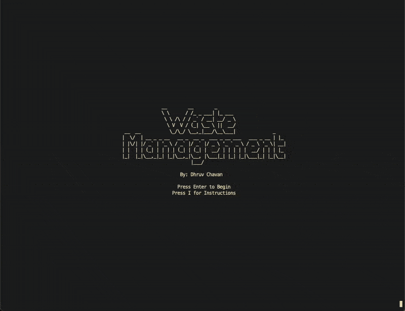

swim for life while also learning about the impacts of poor waste management



## how to run

- ensure you have C installed
- if it is necessary to recompile, you can do so with gcc: ```gcc -lncurses p.c -o ./p.c```
    - feel free to use another C compiler but make sure to link the ncurses library
- execute the program with `./p`

## how to play

- use wasd and the arrow keys to move the top and bottom fish up, left, down, and right respectively
- escape from a shark with another person (or your other hand) while attemping to evade incoming trash
- try live as long as you can!
- endangered species will occasionally swim past you at the top of your window, and you can learn more about them in `./encyclopedia.txt`, which expands after every novel encounter

